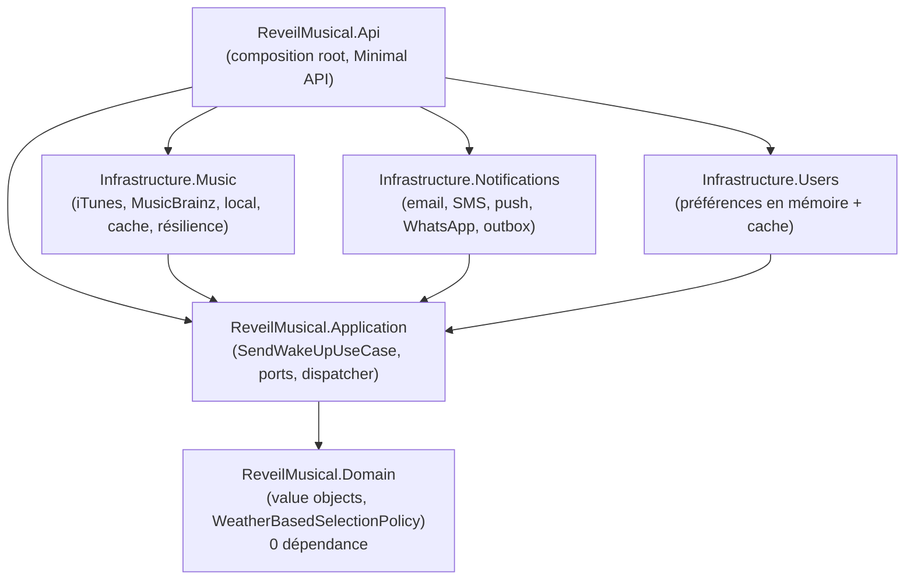
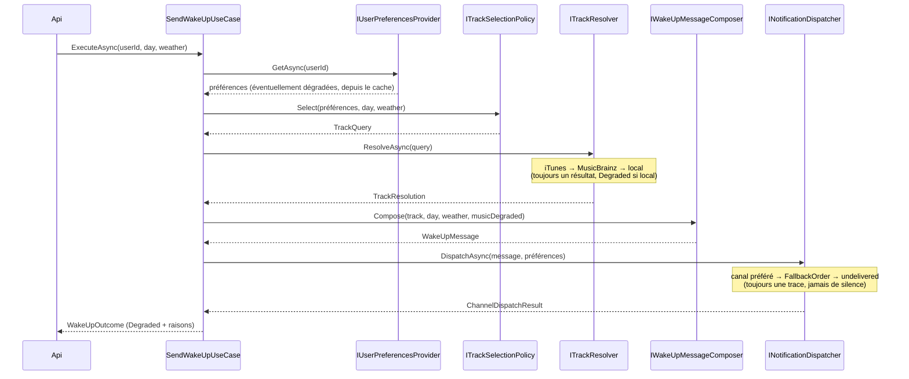

# Réveil musical

[](https://github.com/albandvd/EMA-S9-DS-Gestion-des-dependances/actions/workflows/ci.yml)

Service qui réveille chaque utilisateur avec un morceau choisi selon le jour de la semaine et la météo du jour, puis le prévient sur son canal préféré — sans jamais rester silencieux en cas de panne.

> TP sur la gestion des dépendances, le découplage, l'IoC/DI, la résilience et l'audit des licences. Cahier des charges complet : [PROMPT_reveil_musical.md](./PROMPT_reveil_musical.md).

## Sommaire

- [Prérequis](#prérequis)
- [Commandes](#commandes)
- [Architecture](#architecture)
- [Patterns utilisés](#patterns-utilisés)
- [Changer de fournisseur de musique](#changer-de-fournisseur-de-musique)
- [Ajouter un canal de notification](#ajouter-un-canal-de-notification)
- [Matrice de résilience](#matrice-de-résilience)
- [Hypothèses](#hypothèses)
- [Dépendances et licences](#dépendances-et-licences)
- [Composants écartés et pourquoi](#composants-écartés-et-pourquoi)
- [Points de vigilance](#points-de-vigilance)
- [CI](#ci)
- [Historique Git](#historique-git)

## Prérequis

- [.NET SDK 10.0.401](https://dotnet.microsoft.com/download) ou plus récent (version épinglée par `global.json`, `rollForward: latestFeature`).
- Aucune base de données ni service externe requis pour faire tourner le projet : les préférences utilisateur sont en mémoire, les SDK d'email/SMS/push/WhatsApp sont des fakes, iTunes/MusicBrainz sont de vraies API publiques mais désactivables par configuration.

## Commandes

```bash
# Build
dotnet build

# Tests (unitaires + intégration + architecture), aucun appel réseau réel
dotnet test

# Vérifier le formatage (identique à la CI)
dotnet format --verify-no-changes

# Lancer l'API en local (profil "http", port 5269)
dotnet run --project src/ReveilMusical.Api

# Lancer l'API en mode dégradé (musique + tous les canaux en panne simulée)
dotnet run --project src/ReveilMusical.Api --environment Demo-Degraded

# Couverture de code (génère TestResults/ puis coverage/)
dotnet test -c Release --collect:"XPlat Code Coverage" --results-directory ./TestResults
dotnet tool run reportgenerator \
  -reports:"TestResults/**/coverage.cobertura.xml" \
  -targetdir:"coverage" \
  -reporttypes:"Html;MarkdownSummaryGithub;JsonSummary" \
  -assemblyfilters:"+ReveilMusical.*;-ReveilMusical.*Tests" \
  -filefilters:"+*;-*OpenApiXmlCommentSupport*"
open coverage/index.html   # rapport HTML, ignoré par Git

# Audit des licences (voir aussi la section Dépendances et licences)
dotnet tool restore
dotnet tool run dotnet-project-licenses --allow-roll-forward -- \
  --input . --allowed-license-types licenses-allowed.json --include-transitive \
  --use-project-assets-json --manual-package-information license-exceptions.json \
  --json --outfile licenses-report.json

# SBOM CycloneDX
dotnet tool run dotnet-CycloneDX --allow-roll-forward -- ReveilMusical.slnx -o docs/sbom -fn sbom.json -F Json
```

Un fichier [`src/ReveilMusical.Api/ReveilMusical.Api.http`](./src/ReveilMusical.Api/ReveilMusical.Api.http) fournit des exemples de requêtes (nominal, jour/météo en anglais, fallback musique, repli de canal, utilisateur inconnu, entrée invalide, `/health`).

## Architecture

Architecture hexagonale (ports & adaptateurs). Les flèches pointent vers le Domain ; aucune dépendance n'en sort jamais.



Séquence d'un réveil réussi, avec le point de dégradation possible à chaque étape :



## Patterns utilisés

| Pattern | Où | Besoin métier servi |
|---|---|---|
| **Adapter** | `ItunesTrackProvider`, `MusicBrainzTrackProvider`, `LocalFallbackTrackProvider` (tous `ITrackProvider`) ; `EmailChannelAdapter`, `SmsChannelAdapter`, `PushChannelAdapter`, `WhatsAppChannelAdapter` (tous `INotificationChannel`) | Normaliser des SDK hétérogènes (signatures sync/async, exception/bool/reçu) derrière un seul contrat, sans que le Domain/Application ne connaisse le fournisseur réel |
| **Strategy** | `ITrackSelectionPolicy` / `WeatherBasedSelectionPolicy` | Changer la règle de choix du morceau (ex. playlist spéciale le week-end) sans toucher `SendWakeUpUseCase` |
| **Chain of Responsibility** | `FallbackChainTrackResolver` (iTunes → MusicBrainz → local) ; `NotificationDispatcher` (canal préféré → `FallbackOrder` → `undelivered`) | Une panne isolée ne doit jamais empêcher le réveil |
| **Decorator** | `CachingTrackProvider` (autour de chaque provider HTTP) ; `CachingUserPreferencesProvider` (autour du provider en mémoire) | Cache + dernière valeur connue, sans changer le contrat du port décoré |
| **Factory / Composition via DI** | `AddMusicProviders`, `AddNotificationChannels`, `AddUserPreferences`, `AddReveilMusicalApplication` | Un seul point d'enregistrement public par projet ; `Program.cs` ne contient que ces appels |

## Changer de fournisseur de musique

Entièrement piloté par `appsettings.json`, section `Music` — **aucune recompilation** :

```json
"Music": { "Providers": [ "itunes", "musicbrainz" ] }
```

- Inverser l'ordre : `[ "musicbrainz", "itunes" ]`.
- N'utiliser que le fallback local : `[]` (le provider local est toujours ajouté implicitement en bout de chaîne, il ne se liste pas).
- Une clé inconnue (ex. `"spotify"`) fait échouer le démarrage avec un message explicite (`MusicOptionsValidation`), pas une erreur silencieuse à la première requête.
- Testé bout en bout dans `WakeUpEndpointTests.PostWakeUp_SwitchingMusicProvidersByConfig_ChangesWhichTrackIsUsed_NoRecompilation`, qui démarre deux `WebApplicationFactory` ne différant que par `Music:Providers` et vérifie qu'elles résolvent des morceaux différents.

## Ajouter un canal de notification

Démontré dans la branche `feature/whatsapp-channel` (voir [l'historique Git](#historique-git)) : ajouter WhatsApp a nécessité

1. `FakeWhatsAppClient.cs` (nouveau) — un SDK simulé de plus, avec une signature volontairement différente des trois autres (retourne un enum `WhatsAppDeliveryStatus` plutôt qu'une exception, un `bool` ou un reçu).
2. `WhatsAppChannelAdapter.cs` (nouveau) — implémente `INotificationChannel`, convertit `Failed` en exception.
3. Deux lignes dans `AddNotificationChannels` (`ServiceCollectionExtensions.cs`) pour enregistrer le fake SDK et l'adaptateur.
4. Une propriété `WhatsApp` ajoutée à `NotificationsOptions` pour son flag `SimulateFailure`, suivant le même pattern que les trois canaux existants.

Aucun fichier de `Domain`, `Application`, ni des trois autres adaptateurs n'a changé. Le seul test pré-existant à avoir dû bouger est l'assertion de `AddNotificationChannelsTests` qui énumère tous les canaux enregistrés (normal : il y a désormais un canal de plus à énumérer).

## Matrice de résilience

| Panne | Comportement | Résultat observé |
|---|---|---|
| iTunes en panne/lent | MusicBrainz tenté ensuite | morceau réel, `MusicDegraded: false` |
| iTunes + MusicBrainz en panne | fallback local | `MusicDegraded: true` |
| Morceau introuvable partout | fallback local | `MusicDegraded: true` |
| Le resolver lève quand même une exception | `FallbackTrack` brut de l'utilisateur (titre = texte de la requête, artiste "Artiste inconnu") | `MusicDegraded: true` |
| Service préférences en panne, cache présent | préférences en cache (`CachingUserPreferencesProvider`) | `200`, `Degraded: true` |
| Service préférences en panne, pas de cache | `UserPreferencesUnavailableException` propagée | `503 Service Unavailable` + log `Critical` |
| Canal préféré en panne | canal suivant de `Notifications:FallbackOrder` | `ChannelDegraded: true` |
| Canal préféré non enregistré (ex. `"signal"`) | repli sur `FallbackOrder` | `ChannelDegraded: true` |
| Tous les canaux en panne | `LastResortChannel` (`undelivered`), tracé dans `outbox/undelivered.log` + log `Critical` | `200`, `Degraded: true`, jamais de silence |

Reproductible en une commande : `dotnet run --project src/ReveilMusical.Api --environment Demo-Degraded` (voir `appsettings.Demo-Degraded.json` — iTunes/MusicBrainz et les quatre canaux simulent tous une panne, de façon déterministe et sans dépendre du réseau réel).

## Hypothèses

- **Jour de la semaine** : le service de préférences ne fournit des morceaux que par météo, pas par jour. Le jour est donc utilisé (a) dans le texte du message (« Bon lundi ! ») et (b) passé à `ITrackSelectionPolicy.Select(...)`, ce qui permet d'ajouter une règle par jour (ex. playlist du week-end) en écrivant une nouvelle policy, sans toucher `SendWakeUpUseCase`. Couvert par `SendWakeUpUseCaseTests.ExecuteAsync_UsesInjectedSelectionPolicy_ProvesPolicyIsPluggable`.
- **Fallback local et "météo"** : `ITrackProvider.FindAsync` ne reçoit qu'un texte de requête (`TrackQuery`), jamais la météo elle-même — ce contrat est partagé par iTunes/MusicBrainz/local, qui ne connaissent pas la notion de météo. `LocalFallbackTrackProvider` fait donc une correspondance texte (titre/artiste contient la requête), et retourne sinon le premier morceau de son catalogue : la "sensibilité à la météo" du système vient entièrement de `WeatherBasedSelectionPolicy` en amont (quel texte on cherche), pas du provider local lui-même.
- **Utilisateur inconnu** : `IUserPreferencesProvider.GetAsync` retourne `Preferences: null` (pas une exception) : c'est un cas métier normal (404), à distinguer d'une vraie panne de service (exception → 503).
- **Service de préférences en panne sans cache** : on ne peut pas savoir à qui envoyer un message de secours, donc on refuse honnêtement (`503`) plutôt que d'inventer un comportement ; c'est la seule situation documentée où le service ne répond pas `200`.
- **Dégradation globale (`WakeUpOutcome.Degraded`)** : calculée comme "au moins une raison de dégradation", pas comme `MusicDegraded || ChannelDegraded`. Une préférence utilisateur servie depuis le cache est une dégradation (le client doit le voir) sans être ni l'une ni l'autre des deux causes nommées.

## Dépendances et licences

**Date du dernier audit : 2026-10-08.** Commande : voir [Commandes](#commandes). Rapport complet (80 paquets uniques, directs + transitifs) : [`docs/licenses/licenses.md`](./docs/licenses/licenses.md) / [`licenses.json`](./docs/licenses/licenses.json). SBOM CycloneDX : [`docs/sbom/sbom.json`](./docs/sbom/sbom.json).

Toutes les licences détectées sont **MIT (64), Apache-2.0 (11) ou BSD-3-Clause (5)** — aucune copyleft, aucune inconnue en dehors de l'exception documentée ci-dessous. Liste blanche versionnée : [`licenses-allowed.json`](./licenses-allowed.json) ; exceptions justifiées : [`license-exceptions.json`](./license-exceptions.json).

### Dépendances directes (production)

| Paquet | Projet(s) | Version | Dernière stable | Publiée | Licence | Commentaire |
|---|---|---|---|---|---|---|
| Microsoft.Extensions.DependencyInjection(.Abstractions) | Domain → non ; Application, toutes les Infrastructure, Api | 10.0.12 | 10.0.12 | 2026-09 | MIT | Conteneur IoC standard |
| Microsoft.Extensions.Logging.Abstractions | Application | 10.0.12 | 10.0.12 | 2026-09 | MIT | Pas d'implémentation concrète liée |
| Microsoft.Extensions.Options(.ConfigurationExtensions/.DataAnnotations) | Application, toutes les Infrastructure | 10.0.12 | 10.0.12 | 2026-09 | MIT | `IOptions<T>` + `ValidateDataAnnotations()` + `ValidateOnStart()` |
| Microsoft.Extensions.Caching.Memory | Infrastructure.Music, Infrastructure.Users | 10.0.12 | 10.0.12 | 2026-09 | MIT | Cache musique + dernière valeur connue des préférences |
| Microsoft.Extensions.Http | Infrastructure.Music | 10.0.12 | 10.0.12 | 2026-09 | MIT | Typed clients, pas de `new HttpClient` |
| Microsoft.Extensions.Http.Resilience | Infrastructure.Music | 10.10.0 | 10.10.0 | 2026-09 | MIT | Timeout/retry/circuit breaker (Polly v8 sous le capot) ; suit son propre schéma de version, indépendant du cycle `10.0.x` du cœur .NET — voir [Points de vigilance](#points-de-vigilance) |
| System.Net.Http.Json | Infrastructure.Music | 10.0.12 | 10.0.12 | 2026-09 | MIT | Désérialisation JSON des réponses iTunes/MusicBrainz |
| Microsoft.AspNetCore.OpenApi | Api | 10.0.12 | 10.0.12 | 2026-09 | MIT | Génération OpenAPI native (.NET 9+) |
| TngTech.ArchUnitNET(.xUnit) | Architecture.Tests | 0.13.4 | 0.13.4 | 2026-08 | Apache-2.0 | Choisi plutôt que NetArchTest.Rules — voir [Composants écartés](#composants-écartés-et-pourquoi) |
| xunit / xunit.runner.visualstudio | tous les projets de test | 2.9.3 / 4.0.0 | idem | 2025-01 / 2026-08 | Apache-2.0 | |
| Microsoft.NET.Test.Sdk / coverlet.collector | tous les projets de test | 18.10.1 / 10.1.0 | idem | 2026-09 | MIT | |
| Shouldly | tous les projets de test | 4.3.0 | 4.3.0 | 2025-01 | BSD-3-Clause | |
| NSubstitute | Application.Tests, Infrastructure.Tests, Api.Tests | 6.2.0 | 6.2.0 | 2026-08 | BSD-3-Clause | |
| Microsoft.AspNetCore.Mvc.Testing | Api.Tests | 10.0.12 | 10.0.12 | 2026-09 | MIT | `WebApplicationFactory<Program>` |
| Microsoft.Extensions.TimeProvider.Testing | Infrastructure.Tests | 10.10.0 | 10.10.0 | 2026-09 | MIT | `FakeTimeProvider` pour le budget global du resolver musique |

Outils locaux (`dotnet-tools.json`, non livrés dans le binaire de l'app) : `dotnet-project-licenses` 2.7.1 (MIT), `dotnet-reportgenerator-globaltool` 5.5.11 (Apache-2.0), `CycloneDX` 6.2.0 (Apache-2.0).

### Services externes

| Service | Usage | Conditions |
|---|---|---|
| iTunes Search API | 1er fournisseur musique par défaut | Gratuit, pas de clé requise, pas de SLA garanti ; conditions d'utilisation Apple. ~20 req/min respecté côté client (rate limiter token-bucket) |
| MusicBrainz API | 2ᵉ fournisseur musique par défaut | CC0 pour les métadonnées ; **User-Agent de contact obligatoire** (app refuse de démarrer sans) ; limite ~1 req/s respectée côté client |

## Composants écartés et pourquoi

| Composant | Raison |
|---|---|
| **Moq** | Épisode SponsorLink (2023) : le package collectait des emails de développeurs au build sans consentement clair → NSubstitute à la place. |
| **FluentAssertions v8+** | Passée sous licence commerciale payante → Shouldly (BSD-3-Clause). |
| **MediatR / AutoMapper** | Passés sous licence commerciale par leur auteur ; de toute façon inutiles ici (un seul cas d'usage, mapping manuel dans les adaptateurs — plus explicite que des profils AutoMapper). |
| **NetArchTest.Rules** | Candidat initial pour les tests d'architecture (suggestion du cahier des charges). Sa dernière publication NuGet date de **mai 2021** et le paquet ne porte **aucune métadonnée de licence** (`licenseExpression` et `licenseUrl` absents du nuspec), bien que son dépôt GitHub soit MIT. Un outil d'audit automatisé ne peut pas le vérifier, ce qui aurait exigé une exception non justifiable pour un projet actif ailleurs. → **TngTech.ArchUnitNET** (Apache-2.0, publié août 2026, métadonnées propres), alternative explicitement proposée par le cahier des charges. |
| **Tout SDK iTunes/MusicBrainz tiers** | Les deux API sont de simples `GET` JSON ; `System.Net.Http.Json` suffit et évite une dépendance transitive non maîtrisée. |

## Points de vigilance

- **`xunit.abstractions` 2.0.3** (dépendance transitive de `xunit`, test uniquement) : NuGet n'expose qu'un `licenseUrl` historique pointant vers le fichier `license.txt` du dépôt `xunit/xunit`, sans expression SPDX exploitable automatiquement par l'outil d'audit. Vérifié manuellement (Apache-2.0, identique au paquet `xunit` principal) et documenté dans [`license-exceptions.json`](./license-exceptions.json) plutôt que silencieusement ajouté à la liste blanche globale.
- **`Microsoft.Extensions.Http.Resilience` 10.10.0** : ce paquet (et toute la famille "Microsoft.Extensions.*" issue du dépôt `dotnet/extensions` hors cœur ASP.NET Core) suit son propre schéma de version (`10.6.0` → `10.10.0` sur 2026), distinct du cycle `10.0.x` des paquets cœur comme `Microsoft.Extensions.Logging.Abstractions`. C'est la version stable la plus récente au moment de l'audit ; ce n'est pas un retard, juste un schéma de version différent à ne pas confondre avec une version `10.0.x` manquante.
- **Dépendances transitives en retard** (`dotnet list package --outdated --include-transitive`, non bloquant en CI) : `Castle.Core` (NSubstitute), `DiffEngine`/`EmptyFiles` (Shouldly), `Microsoft.OpenApi` (Microsoft.AspNetCore.OpenApi), `Polly.Core/Extensions/RateLimiting` et `System.Threading.RateLimiting` (Microsoft.Extensions.Http.Resilience), `xunit.analyzers` (xunit) sont toutes résolues à des versions antérieures à leur dernière publication. Ce sont des choix faits par les paquets directs eux-mêmes (leurs propres bornes de version), pas des dépendances que ce projet référence directement ; ils sont suivis par Dependabot (groupés avec leur paquet parent) plutôt que forcés manuellement, pour éviter d'introduire une version non testée par les mainteneurs du paquet direct.
- **Aucune version en retard du côté des dépendances directes** de production : tous les paquets `Microsoft.Extensions.*`, `Microsoft.AspNetCore.*` et `System.Net.Http.Json` sont épinglés à `10.0.12`, la dernière patch disponible au moment de l'audit pour la branche .NET 10.

## CI

Workflow [`ci.yml`](./.github/workflows/ci.yml), déclenché sur push vers `main`, sur chaque pull request et manuellement (`workflow_dispatch`).

| Job | Bloquant ? | Contenu |
|---|---|---|
| `build-and-test` | **Oui** | Restore verrouillé (`--locked-mode`), build Release (warnings = erreurs), `dotnet format --verify-no-changes`, tests + couverture, échec si la couverture passe sous 90 % (Domain+Application) ou 80 % (global, hors code généré par le générateur de sources OpenAPI) |
| `dependency-audit` | **Partiellement** | Vulnérabilités connues (`NuGetAudit`, bloquant dès le `restore`) ; paquets obsolètes (informatif, résumé dans `GITHUB_STEP_SUMMARY`) ; licences hors liste blanche (bloquant) |
| `dependency-review` | Oui (PR uniquement) | `actions/dependency-review-action` signale toute dépendance ajoutée par la PR qui serait vulnérable ou sous licence refusée |
| `sbom` | Non (artefact) | Génère et publie le SBOM CycloneDX à chaque push sur `main` |

Lien avec l'exigence légale « aucun composant externe sans vérification de licence et de fraîcheur » : la licence est vérifiée automatiquement à chaque build (bloquant), la fraîcheur est surfacée à chaque build (informatif, décision humaine assumée plutôt qu'auto-upgrade aveugle), et [`Dependabot`](./.github/dependabot.yml) ouvre chaque semaine des PR de mise à jour qui repassent par cette même CI.

La CI ne fait **aucun appel réseau vers iTunes ou MusicBrainz** : tous les tests utilisent des doublons de test et des fixtures JSON enregistrées.

**Protection de `main` recommandée** (dépôt GitHub) : PR obligatoire avant merge, statut CI obligatoire (`build-and-test`, `dependency-audit`), pas de force-push, au moins une revue.

## Historique Git

Chaque fonctionnalité a été développée sur sa propre branche (`feature/…`, `ci/…`, `test/…`, `chore/…`, `docs/…`) et mergée dans `main` en `--no-ff`, puis supprimée. Aucun commit direct sur `main` après l'initialisation du dépôt. Voir `git log --oneline --graph` pour le détail ; tag `v1.0.0` sur la version livrable.
